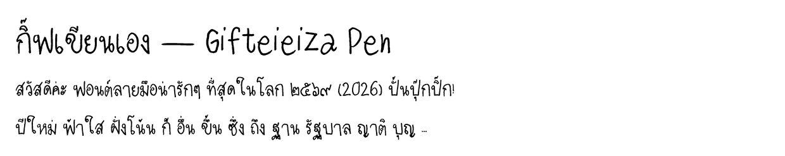

# Gifteieiza Pen — ฟอนต์ลายมือกิฟ (ปากกาลูกลื่น) ✒️

ฟอนต์ตัวที่สองของตระกูล Gifteieiza — ลายมือชุดปากกาลูกลื่น เส้นบาง โปร่ง อ่านสบาย
สร้างด้วย pipeline เดียวกับ [Gifteieiza](../gifteieiza/) (แม่แบบ → สแกน → ตัด → trace → TTF)

## ต่างจากตัวแรกยังไง

- ลายเส้นปากกาลูกลื่น 0.5 มม. บางกว่าชุดแรก (ชุดแรกเป็นปากกาเมจิก)
- ชุดนี้เขียนบนแม่แบบรุ่นแรกที่ยังไม่มีกรอบบอกขนาด ตัวอักษรจึงเล็กกว่ามาตรฐาน —
  ตอน build มีขั้น **normalize**: ขยายทั้งชุดให้หัวพยัญชนะสูงมาตรฐาน (`--scale-to 545`)
  วางฐานอักษรให้แตะเส้นฐาน และดึงสระบน–ล่าง–วรรณยุกต์ลงมาเกาะหัวอักษรพอดี (`--tighten`)
- ฐ ญ ที่เขียนหางไว้ในบรรทัด: วางตัวบนเส้นฐาน ให้หางห้อยใต้เส้นแบบตัวพิมพ์ (`--tail ญฐ`, v1.1)

ระบบวรรณยุกต์ 2 ตำแหน่ง (GSUB `ccmp`) + จัดกึ่งกลางอัตโนมัติ (GPOS `mark`/`mkmk`)
เหมือนตัวแรกทุกอย่าง — กิ๊ฟ ที่สุด เสื้อ ไม่มีทับกัน

## Rebuild

จากโฟลเดอร์หลักของ repo: `python tools/rebuild_all.py gifteieiza-pen`
(ถ้าจะตัดตัวอักษรจากสแกนใหม่: `python tools/extract.py --prefix "font1" --out <โฟลเดอร์> --skip ""`)

## ลิขสิทธิ์

ลายมือและฟอนต์ © 2026 กิฟ (Netthip) — สงวนสิทธิ์ ยังไม่ได้กำหนดสัญญาอนุญาตเผยแพร่
