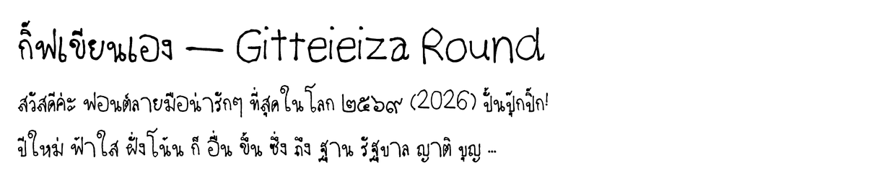

# Gifteieiza Round — ฟอนต์ลายมือกิฟ (ตัวกลมหนา สปริงตัว ขี้เล่น)

หนึ่งใน 4 สไตล์จากแม่แบบมินิ (เขียนเล็ก 4 หน้า) สแกนจาก `font-2-.pdf` หน้า s4 s7 s12 s14
ระบบวรรณยุกต์ 2 ตำแหน่ง + จัดกึ่งกลางอัตโนมัติ เหมือนฟอนต์หลักทุกอย่าง



Rebuild (จากโฟลเดอร์หลักของ repo):
```
python tools/rebuild_all.py gifteieiza-round
```

ลิขสิทธิ์: ลายมือและฟอนต์ © 2026 กิฟ (Netthip) — สงวนสิทธิ์
