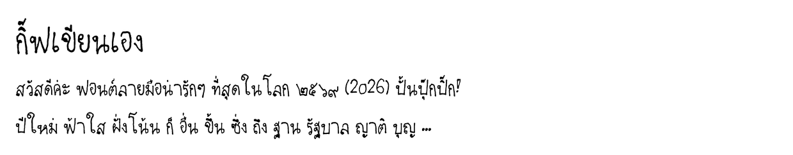

# Gifteieiza Soft — ฟอนต์ลายมือกิฟ (โค้งมนนุ่มนวล)

หนึ่งใน 4 สไตล์จากแม่แบบมินิ (เขียนเล็ก 4 หน้า) สแกนจาก `font-2-.pdf` หน้า s2 s6 s11 (ไม่มีหน้า 4)
ระบบวรรณยุกต์ 2 ตำแหน่ง + จัดกึ่งกลางอัตโนมัติ เหมือนฟอนต์หลักทุกอย่าง

> **หมายเหตุ:** สไตล์นี้ยังไม่มีตัวอังกฤษ T–Z และ a–z (ขาดแม่แบบมินิหน้า 4) — เขียนเพิ่มแล้วส่งมาเมื่อไหร่ค่อยเติมเข้าไฟล์ฟอนต์ได้



Rebuild (จากโฟลเดอร์หลักของ repo):
```
python tools/rebuild_all.py gifteieiza-soft
```

ลิขสิทธิ์: ลายมือและฟอนต์ © 2026 กิฟ (Netthip) — สงวนสิทธิ์
