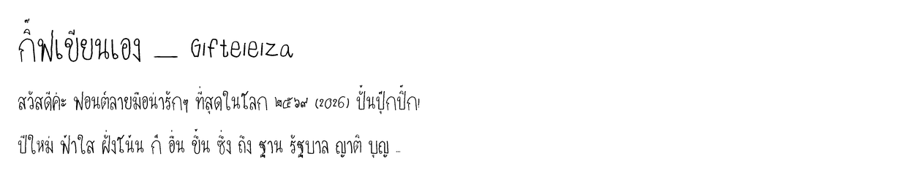

# Gifteieiza — ฟอนต์ลายมือของกิฟ ✍️

ฟอนต์ TrueType ที่สร้างจากลายมือจริง เขียนลงแม่แบบกระดาษ สแกน 600 dpi
แล้วแปลงเป็นฟอนต์อัตโนมัติทั้งกระบวนการ (ตัดตัวอักษร → vectorize → ประกอบ TTF)

## จุดเด่น

- **วรรณยุกต์ไม่ทับสระบน** — วรรณยุกต์ ( ่ ้ ๊ ๋ ์ ) มี 2 ชุดจากลายมือจริง:
  ตำแหน่งปกติ (ก่ ป้า) และตำแหน่งสูง (กิ่ กิ๊ ที่ เสื้อ) สลับให้อัตโนมัติด้วย
  OpenType GSUB (`ccmp`) — คำว่า **กิ๊ฟ** สระอิกับไม้ตรีแยกชั้นกันเสมอ
- **จัดกึ่งกลางเครื่องหมายอัตโนมัติ** ด้วย GPOS `mark` + `mkmk`
  (รองรับทั้งสระบน สระล่าง และวรรณยุกต์ซ้อนสระ รวมถึงการแยก น้ำ → น + ํ + ้ + า)
- ครอบคลุม: พยัญชนะไทยครบ 44 ตัว สระ–วรรณยุกต์ครบ เลขไทย ๐–๙ เลขอารบิก 0–9
  A–Z a–z และเครื่องหมายวรรคตอนหลัก (รวม ฿ ๆ ฯ และ “ ” ‘ ’ … – — ตั้งแต่ v1.1)

## ติดตั้ง

ดับเบิลคลิก `Gifteieiza-Regular.ttf` แล้วกด **Install** (Windows)
จากนั้นเลือกฟอนต์ "Gifteieiza" ได้ใน Word / Photoshop / Canva ฯลฯ

## โครงสร้าง

| ไฟล์ | คืออะไร |
|---|---|
| `Gifteieiza-Regular.ttf` | ตัวฟอนต์พร้อมใช้ |
| `specimen.png` | ภาพตัวอย่างการเรนเดอร์ |
| `glyphs/` | บิตแมปตัวอักษร 170 ตัวที่ตัดจากสแกน + `meta.json` (ตำแหน่งเส้นฐาน) |
| `../tools/extract.py` | ตัดตัวอักษรจากสแกนแม่แบบ (ต้องมีไฟล์สแกนต้นฉบับ) |
| `../tools/build_font.py` | trace bitmap → contour → ประกอบ TTF + GSUB/GPOS |
| `../tools/geom.json` | พิกัดช่องเขียนของแม่แบบ (หน่วย mm) |

Rebuild (จากโฟลเดอร์หลักของ repo): `python tools/rebuild_all.py gifteieiza`
(ต้องมี `fonttools` `pillow` `numpy` `uharfbuzz`)

แม่แบบกระดาษสำหรับเขียนสไตล์ใหม่อยู่ที่ [`handwriting-font/`](../handwriting-font/)

## ลิขสิทธิ์

ลายมือและฟอนต์ © 2026 กิฟ (Netthip) — สงวนสิทธิ์ ยังไม่ได้กำหนดสัญญาอนุญาตเผยแพร่
